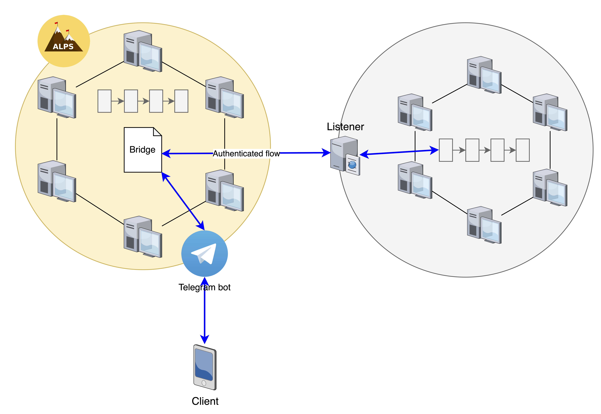

# XCQA

A proof-of-concept framework for cross-chain query authentication.

The main goal of this project is to enable users
of a "source" Ethereum-based blockchain C1 to read values
from another Ethereum-based "target" blockchain network C2.
From the point of view of C1, the network C2 is considered to be *untrusted*,
meaning that there is no guarantee about the integrity and authenticity
of the information coming from nodes of C2.

This proof-of-concept implementation aims at overcoming this limitation:
values received from C2 are guaranteed to be authentic thanks to appropriate
verification mechanisms based on cryptography.

The framework is made up of three components.

1. The **Bridge smart contract**, written in Solidity.
2. A **Telegram bot**, employed by C1 users to interact with the smart contract.
3. A **listener** which simulates the behavior of a C2 responder.

The Bridge smart contract is the main component of the architecture.
It provides methods for submitting requests
(e.g., read the variable <code>x</code>
from the contract <code>0x06012c8cf97BEaD5deAe237070F9587f8E7A266d</code>)
and for verifying the responses.

On the other hand, the Telegram bot enables
a more user-friendly interaction with the smart
contract. Through this bot,
users of C1 may submit requests, check their status and
see how many of them have already been served. Moreover,
the bot also enables the real-time visualization of
served requests: a message will be sent to the user as soon
as one submitted request is verified successfully by the contract.

To simulate the behavior of C2 nodes, this framework provides
a Python-based listener. As the name suggests, this application
continuously listens for requests submitted by C1 users.
As soon as a request arrives, the program contacts the Ethereum mainnet
to fetch the desired information and calls the verification method
inside the contract to deliver the authenticated response to C1.

---

This proof-of-concept implementation was developed for an internship at [ALPS Software Ltd.](http://alps.solutions)
